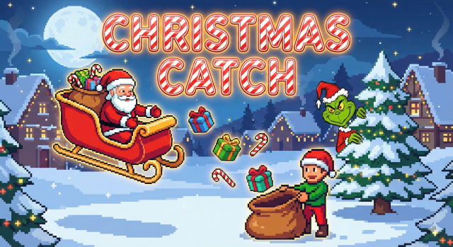

# 🎄 Christmas Catch


Welcome to **Christmas Catch**, a festive experiment in **AI-Native Development**. This project demonstrates how modern tooling and generative AI can be combined to "vibe code" a production-ready web application in record time.



## 🌟 Live Demo

👉 **[Play the Game Here](https://rafaljab.github.io/christmas-game/)**

---

## 🎮 Gameplay

* **Objective:** You are Santa! Move left and right to catch the falling **Presents**.
* **The Threat:** Avoid the **Grinch**! Touching him will cost you a life.
* **Mechanics:**
    * Start with **3 Lives**.
    * **Dynamic Difficulty:** The game speed increases as your score goes up.
    * **High Score:** Persists locally to challenge your friends.

## 🛠️ Architecture & Tech Stack

This project was architected to be lightweight, performant, and easily deployable.

* **Core:** [React](https://react.dev/) + [TypeScript](https://www.typescriptlang.org/) (Strict typing for robustness).
* **Build Tool:** [Vite](https://vitejs.dev/) (For instant HMR and optimized production builds).
* **Styling:** [Tailwind CSS](https://tailwindcss.com/) (Rapid UI prototyping).
* **CI/CD:** **GitHub Actions** (Automated build and deployment pipeline to GitHub Pages).

## 🤖 The "Vibe Code" Stack

This project explores the future of coding by leveraging AI as a pair programmer.

* **IDE:** Google Antigravity IDE
* **Logic Engine:** Gemini 3 Pro (Generated game loop logic and state management).
* **Asset Generation:** Nano Banana Model.

## 🚀 Run Locally

Want to see the code structure?

1.  **Clone the repository:**
    ```bash
    git clone [https://github.com/rafaljab/christmas-game.git](https://github.com/rafaljab/christmas-game.git)
    ```
2.  **Install dependencies:**
    ```bash
    cd christmas-game
    npm install
    ```
3.  **Start the dev server:**
    ```bash
    npm run dev
    ```

---
*Merry Christmas and Happy Coding! ❄️*